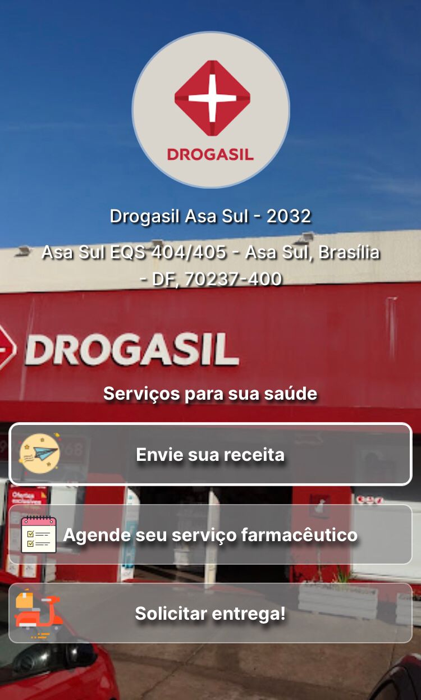

<h1 align="center"> Drogasil 2032 </h1>

 Um site simples pensado em facilitar a vida do cliente  

  <a href="#-descrição">Descrição</a>&nbsp;&nbsp;&nbsp;|&nbsp;&nbsp;&nbsp;
  <a href="#-tecnologias">Tecnologias</a>&nbsp;&nbsp;&nbsp;|&nbsp;&nbsp;&nbsp;
  <a href="#-projeto">Projeto</a>&nbsp;&nbsp;&nbsp;|&nbsp;&nbsp;&nbsp;
  <a href="#-licença">Licença</a>&nbsp;&nbsp;&nbsp;|&nbsp;&nbsp;&nbsp;

  

 

  

# Descrição

Este repositório contém o projeto final de um site desenvolvido com o apoio do gerente da loja, com o objetivo de melhorar a dinâmica do atendimento ao cliente. 
O projeto visa proporcionar uma experiência aprimorada para os clientes durante o atendimento na loja. O site foi desenvolvido levando em consideração as necessidades e feedbacks dos usuários, oferecendo recursos que agilizam o processo de atendimento.

## 🚀 Tecnologias

Esse projeto foi desenvolvido com as seguintes tecnologias:

- HTML e CSS
- Git e Github

## 💻 Projeto

- [Acesse o projeto finalizado, online](https://lucca7r.github.io/drogasil-2032/)

## 👋 Licença

[MIT](https://choosealicense.com/licenses/mit/)
